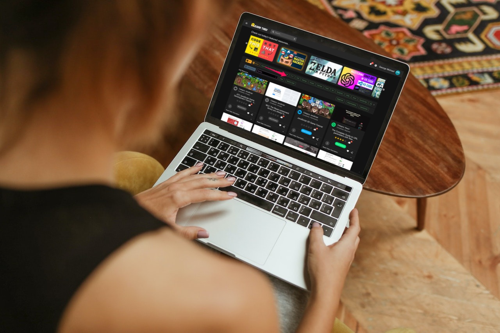
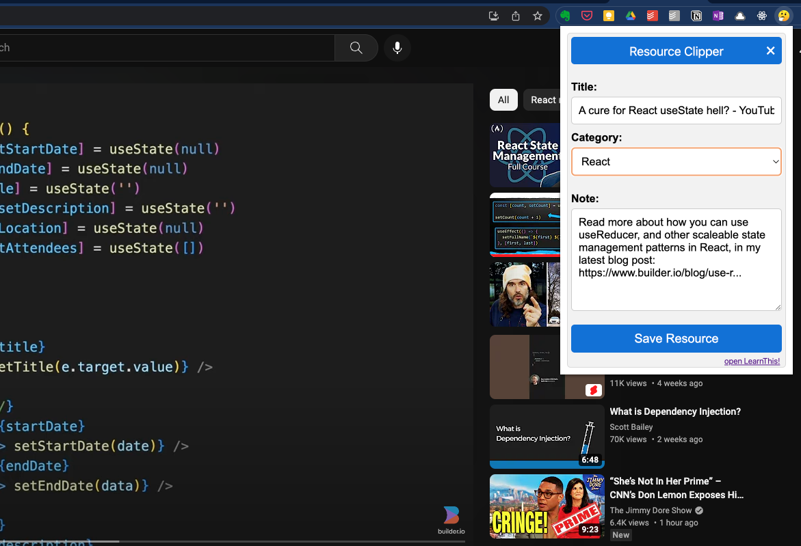
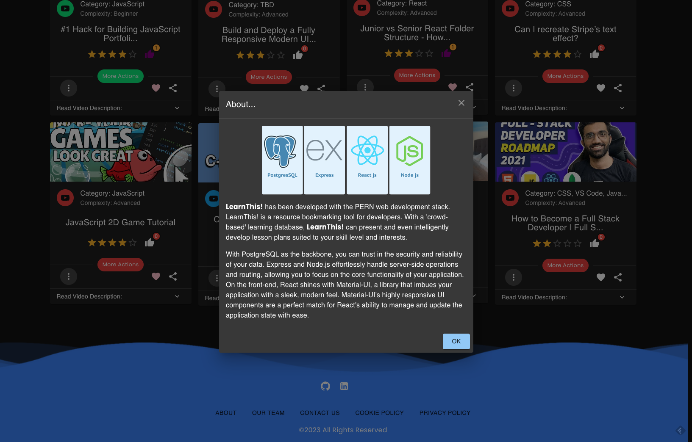

# LearnThis!

A bookmarking, organizational and learning tool built for the developer community.

Keep your resource bookmarks all in one convenient location while having a quick organizational system and a built in learning program to actually study from your saved materials!

---
## Contents...
1. [Getting Started](#getting-started)
2. [Features](#features)
3. [Future Plans](#future-plans)
4. [Known Bugs](#known-bugs)
5. [Attributions](#attributions)
6. [Updates](#updates)
7. [The Team](#the-team)
---
## Getting Started
Clone the repository to your computer.
You'll also need the server and SQL data that is available within this same github repository.

## SERVER Getting Started
1. Create the `.env` by using `.env.example` as a reference: `cp .env.example .env`
2. Update the .env file with your correct local information 
  - username: `development` 
  - password: `development` 
  - database: `finals`
3. Install dependencies: `npm i`
4. Create database finals using 
  - `psql -U development`
  - `create databaase finals;`
5. Reset database: `npm run db:reset`
  - Check the db folder to see what gets created and seeded in the SDB
6. Create account in `screenshotapi.net` and get the `API KEY`
7. Add TOKEN=`API KEY` in .env. See `.env.example`
8. Run the server without nodemon: `npm start`
9. Run the server with nodemon: `npm run local`
  - Note: nodemon is used, so you should not have to restart your server
10. Visit `http://localhost:8080/`
11. login: `12345@test.com` password: `1234`

---
## Features...
  - ## API and Data Structure
  - 

- replace this as necessary

## Bonus features...

- LearnThis! also includes a helpful resource clipping browser extension tool.  One click grabs the title and description of the page you're on and lets you save it quickly into the LearnThis! database!
     
[( back to top 🔺)](#learnthis)
---
## Future Plans...
- continued experimentation through ReactJS components  
[( back to top 🔺)](#learnthis)
---
## Known Bugs...
- none known
- be sure to report any found bugs on Github!  
[( back to top 🔺)](#learnthis)
---
## Attributions...
- [conColors library](https://github.com/ej8899/conColors) (modals & misc animations)
- FontAwesome (various icons)
- Node.js
- PostgreSQL
- SCSS (CSS)
- ReactJS  
[( back to top 🔺)](#lhl-scheduler)
---
## Updates...
- Get the latest of our version of LearnThis! on [Github here](https://github.com/ej8899/lhlfinals).
    
[( back to top 🔺)](#learnthis)
---
## The Team...
- Atsuyuki Yoshimatsu  
(back end API developer)  
- Gene Tenorlas  
(back end API, database schema developer)  
- Ernie Johnson  
(front end, back end interface developer)  
.  
[( back to top 🔺)](#learnthis)
---
